# CFH Furnitualizer – AR Furniture Placement App

**Flutter + Unity + ARCore | Final Year Project (2022–2023)**  
CFH Furnitualizer is an augmented-reality–based furniture shopping application that allows users to **visualize 3D furniture in their actual room** using **ARCore**.  
Built with **Flutter**, **Unity 3D**, and **Firebase**, it provides an immersive, modern shopping experience for customers and a simple management interface for admins.

---

## Overview

Traditional online furniture shopping lacks visualization—customers often buy furniture that does not fit their space or interior.  
CFH Furnitualizer solves this by enabling users to:

- Browse furniture products  
- View detailed specifications  
- Preview furniture in 3D  
- Place furniture directly in their room using **Augmented Reality (ARCore)**  
- Manage cart, orders, and profile  
- Enjoy a clean, user-friendly UI  

The admin panel (via Firebase) allows the business owner to manage products, users, and orders.

This project was developed as a **Final Year BSCS Project** at the International Islamic University Islamabad.

---

## Key Features

### Customer Features
- User registration & login  
- Product catalog with categories  
- Product search  
- Detailed product specifications  
- **3D model viewer (Unity)**  
- **AR furniture placement using ARCore**
  - Plane detection  
  - Real-world surface tracking  
  - Rotation and scale gestures  
  - Light estimation  
- Add to cart, update cart, checkout  
- Order history  
- Profile management  

### Admin Features (via Firebase)
- Add products  
- Edit products  
- Delete products  
- Manage users  
- Process orders  

---

## Tech Stack

### **Frontend – User App**
- Flutter (Dart)  
- Unity 3D  
- ARCore XR Plugin  

### **Backend**
- Firebase Authentication  
- Firebase Firestore  
- Firebase Storage  

### **AR & 3D**
- Unity 3D Engine  
- ARCore (Motion Tracking, Plane Detection, Light Estimation)  

---

## System Architecture

Flutter App (User Interface)
|
| invokes AR mode
|
Unity Module (3D + ARCore)
|
| communicates with device sensors
|
ARCore (Plane detection, motion tracking)

Firebase Backend
├── Authentication
├── Firestore (Products, Users, Orders)
└── Storage

---

## System Modules

### **Client Application**
- Registration & Login  
- Product Catalog  
- Search & Filters  
- 3D Viewer  
- AR Placement  
- Cart & Checkout  
- Order Management  
- User Profile  

### **Admin Panel**
- Product CRUD  
- User Management  
- Order Management  

### **3D & AR Module (Unity)**
- 3D Model Rendering  
- Plane Detection  
- Surface Anchoring  
- Object Placement  
- Gesture Controls  
- Light Estimation  

---

## Functional Flow Summary

✔ 1. User opens the app → Login/Register  
✔ 2. Browse categories → Select product  
✔ 3. View product details → “View in 3D”  
✔ 4. Unity loads the 3D model  
✔ 5. ARCore scans the real environment  
✔ 6. Detects plane → User places furniture  
✔ 7. Scale/rotate → Confirm placement  
✔ 8. Add to cart → Checkout  
✔ 9. Order stored in Firebase → Admin processes  

---

## Testing Summary

Testing included:

### ✔ Unit Tests
- Login  
- Registration  
- Add to cart  
- Product viewing  

### ✔ Integration Tests
- Flutter ↔ Firebase  
- Flutter ↔ Unity  
- Unity ↔ ARCore  

### ✔ AR Tests
- Plane detection accuracy  
- Lighting estimation  
- Scaling, rotation & stability  
- Testing in multiple room environments  

All test cases are documented in the full FYP report.

---

##  Screenshots  

###  Onboarding  
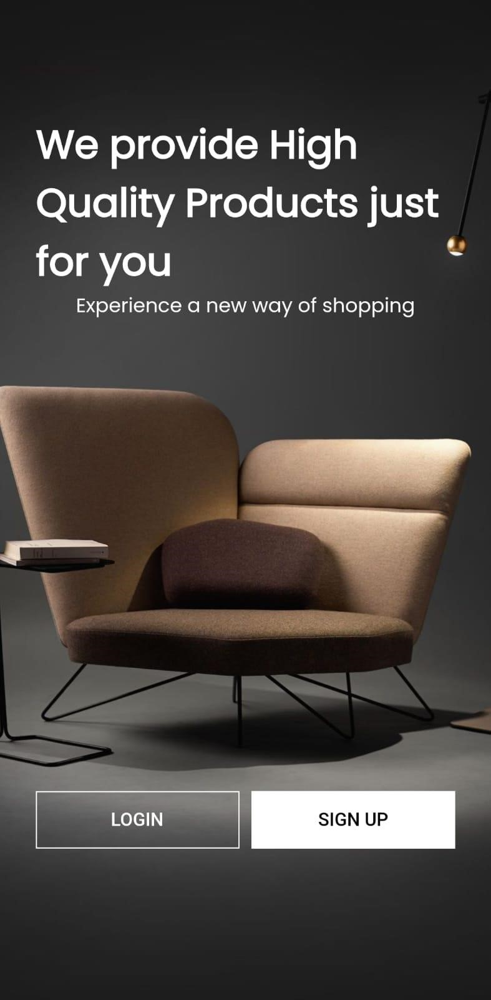

###  Register  

###  Login

###  Home 
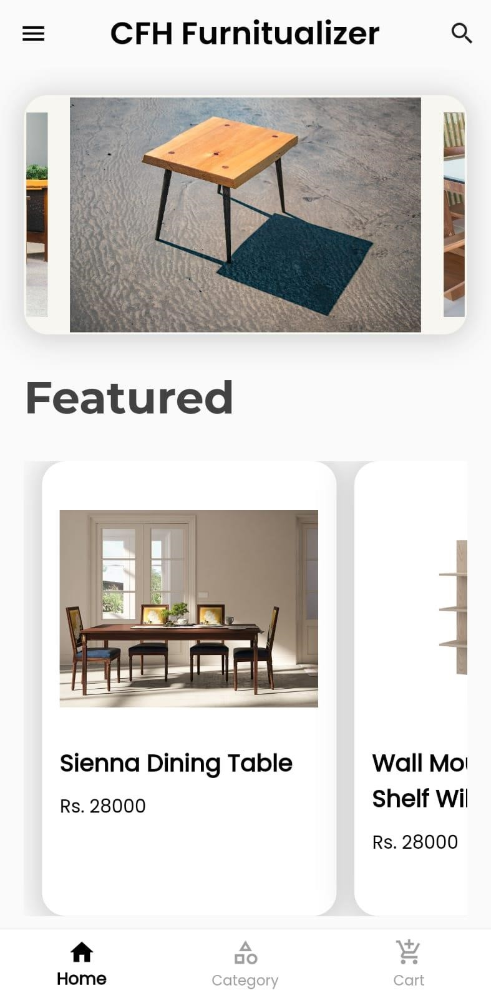
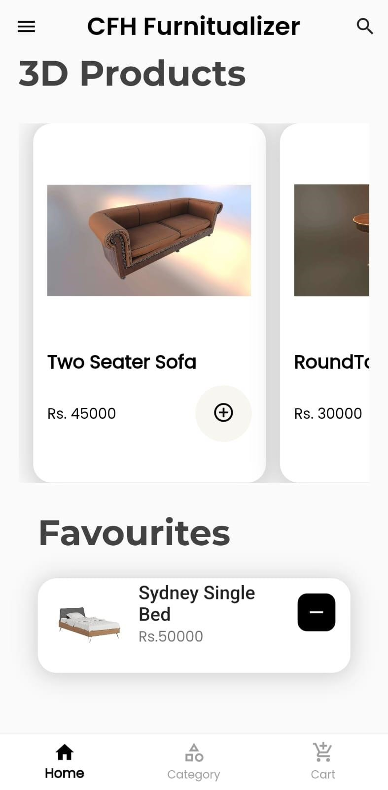

###  Search Products
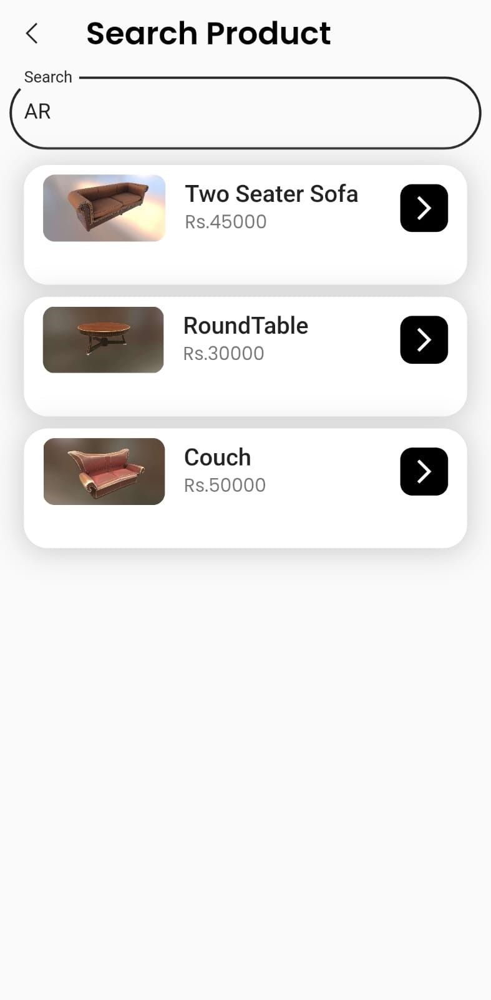

###  Profile

###  Product Detail
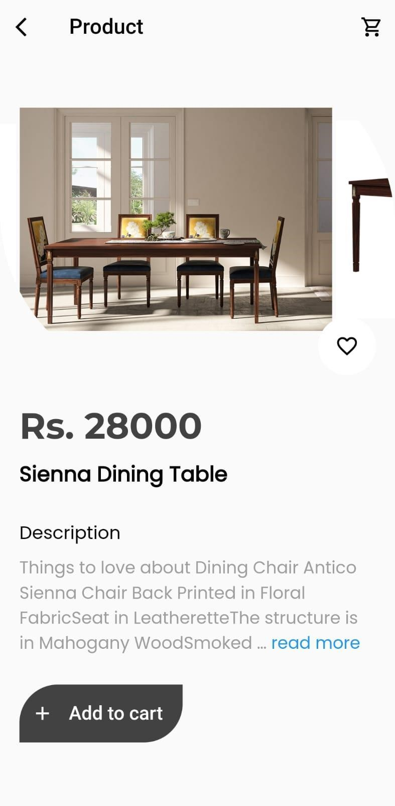

###  3D Product Detail
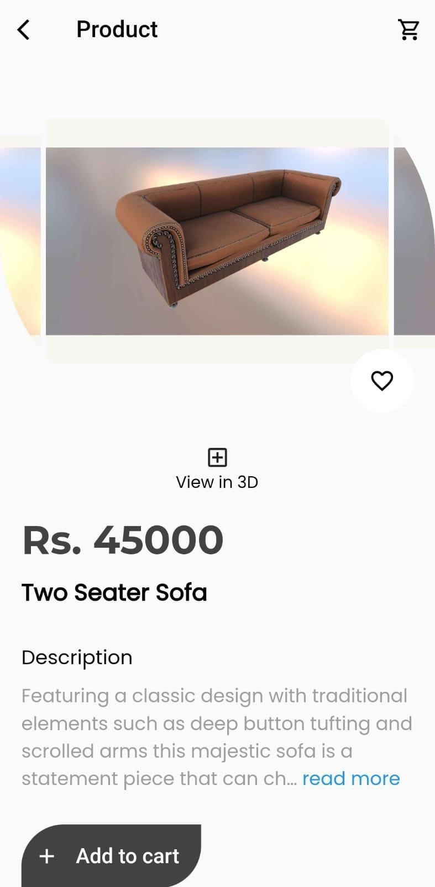

###  AR Placement
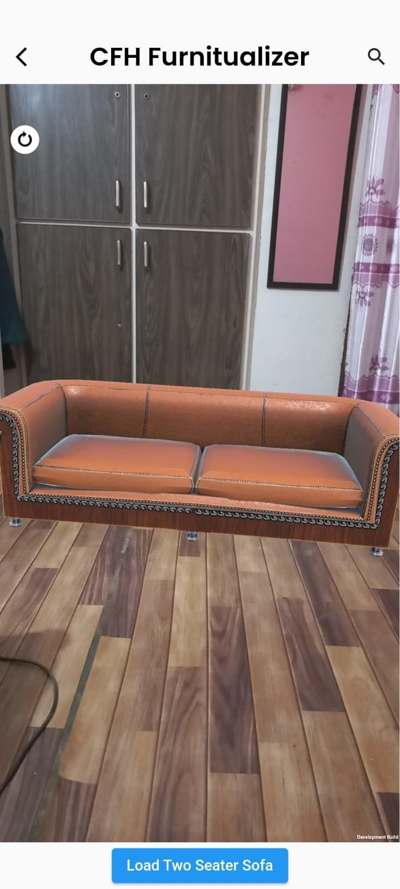

###  Categories
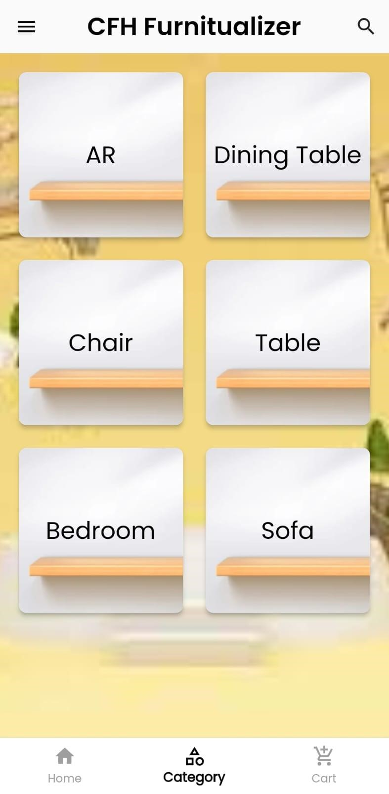

###  Category Product

###  Cart
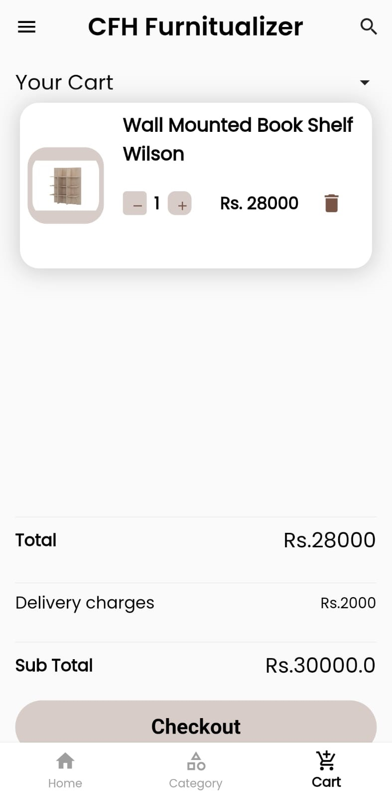

###  Checkout
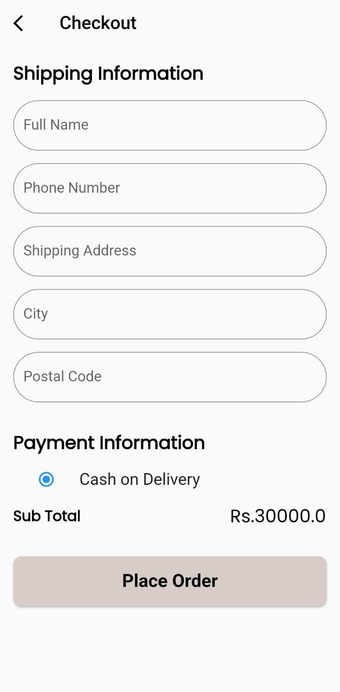

###  Admin Login

###  Admin Dashboard
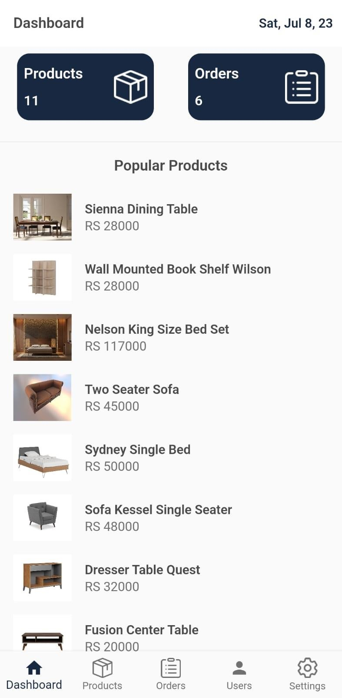

###  Admin Product List
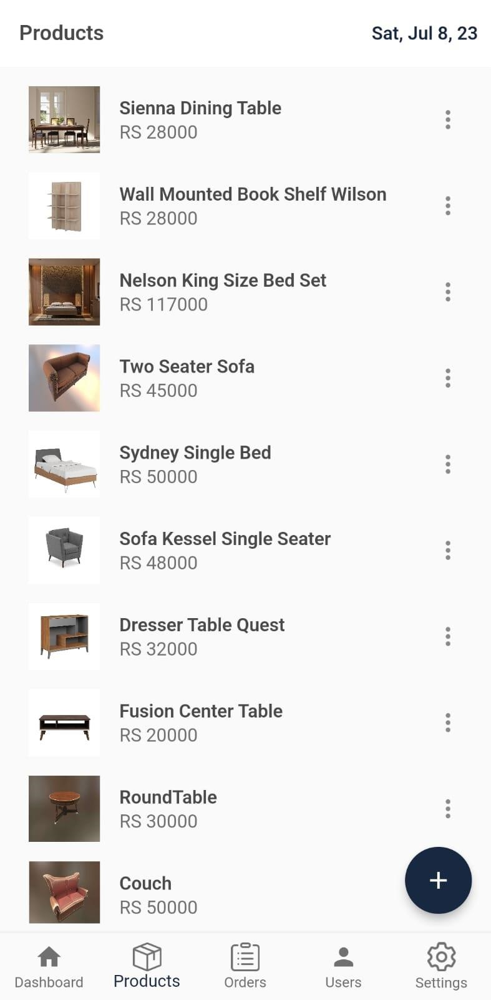
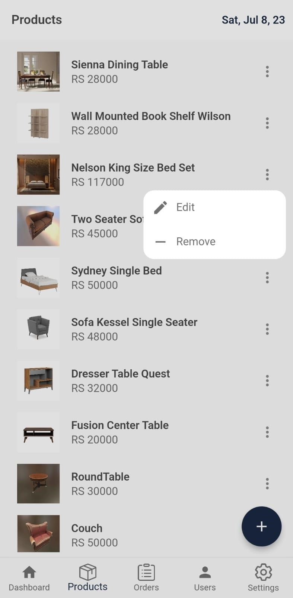

###  Admin Add Product

###  Admin Order Details
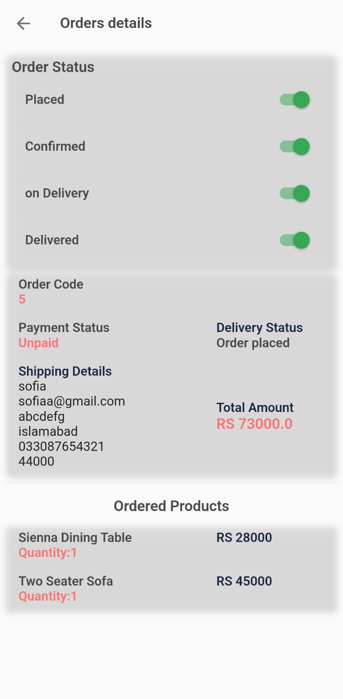

---

## Authors

**Sofia Shafique**  
**Laiba Pervaiz**

Supervised by:  
**Ms. Anum Yasmin**  
International Islamic University Islamabad  

---

## Conclusion

CFH Furnitualizer delivers a fully functional AR-enabled furniture shopping experience.  
By integrating Unity’s 3D capabilities with ARCore’s real-world tracking and Flutter’s rich UI, users can visualize furniture realistically before purchasing — solving the biggest problem in online furniture shopping.

This project showcases the practical application of Augmented Reality in e-commerce and provides a strong foundation for future expansion.

---

## Future Enhancements
- Multi-product AR placement  
- Real-time occlusion  
- Room measurement tools  
- Improved 3D asset optimization  
- Product recommendation engine  
- Payment gateway integration  

---
